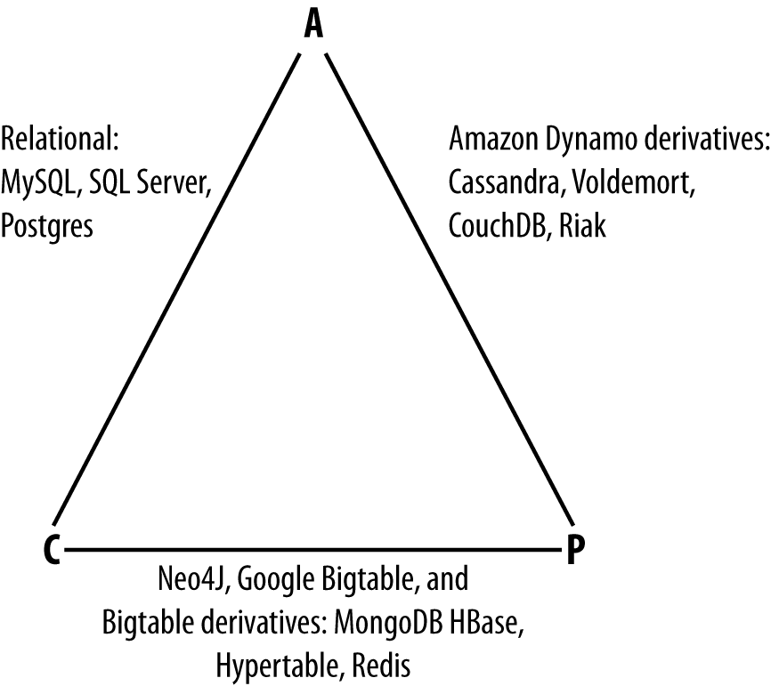

https://learning.oreilly.com/library/view/cassandra-the-definitive/9781491933657/ch02.html#chp-introducing

***Apache Cassandra is an open source, distributed, decentralized, elastically scalable, highly available, fault-tolerant, tuneably consistent, row-oriented database that bases its distribution design on Amazon’s Dynamo and its data model on Google’s Bigtable.  Created at Facebook, it is now used at some of the most popular sites on the Web.***

------------------------------------------------------------------------------------------------------------------------
### Distributed and Decentralized
***Once you start to scale many other data stores (MySQL, Bigtable), some nodes need to be set up as masters in order to organize other nodes, which are set up as slaves. Cassandra, however, is decentralized, meaning that every node is identical***; no Cassandra node performs certain organizing operations distinct from any other node. Instead, Cassandra features a peer-to-peer protocol and uses gossip to maintain and keep in sync a list of nodes that are alive or dead.

***The fact that Cassandra is decentralized means that there is no single point of failure. All of the nodes in a Cassandra cluster function exactly the same.*** This is sometimes referred to as “server symmetry.” Because they are all doing the same thing, by definition there can’t be a special host that is coordinating activities, as with the master/slave setup that you see in MySQL, Bigtable, and so many others.

In many distributed data solutions (such as RDBMS clusters), you set up multiple copies of data on different servers in a process called replication, which copies the data to multiple machines so that they can all serve simultaneous requests and improve performance. Typically this process is not decentralized, as in Cassandra, but is rather performed by defining a master/slave relationship. That is, all of the servers in this kind of cluster don’t function in the same way. You configure your cluster by designating one server as the master and others as slaves. The master acts as the authoritative source of the data, and operates in a unidirectional relationship with the slave nodes, which must synchronize their copies. If the master node fails, the whole database is in jeopardy. The decentralized design is therefore one of the keys to Cassandra’s high availability. Note that while we frequently understand master/slave replication in the RDBMS world, there are NoSQL databases such as MongoDB that follow the master/slave scheme as well.

Decentralization, therefore, has two key advantages: it’s simpler to use than master/slave, and it helps you avoid outages. It can be easier to operate and maintain a decentralized store than a master/slave store because all nodes are the same. That means that you don’t need any special knowledge to scale; setting up 50 nodes isn’t much different from setting up one. There’s next to no configuration required to support it. Moreover, in a master/slave setup, the master can become a single point of failure (SPOF). To avoid this, you often need to add some complexity to the environment in the form of multiple masters. Because all of the replicas in Cassandra are identical, failures of a node won’t disrupt service.

***In short, because Cassandra is distributed and decentralized, there is no single point of failure, which supports high availability.***

------------------------------------------------------------------------------------------------------------------------

### Elastic Scalability
Scalability is an architectural feature of a system that can continue serving a greater number of requests with little degradation in performance.

***Elastic scalability refers to a special property of horizontal scalability. It means that your cluster can seamlessly scale up and scale back down. To do this, the cluster must be able to accept new nodes that can begin participating by getting a copy of some or all of the data and start serving new user requests without major disruption or reconfiguration of the entire cluster. You don’t have to restart your process. You don’t have to change your application queries. You don’t have to manually rebalance the data yourself. Just add another machine—Cassandra will find it and start sending it work.***

Scaling down, of course, means removing some of the processing capacity from your cluster. You might do this for business reasons, such as adjusting to seasonal workloads in retail or travel applications. Or perhaps there will be technical reasons such as moving parts of your application to another platform. As much as we try to minimize these situations, they still happen. But when they do, you won’t need to upset the entire apple cart to scale back.

----------------------------------------------------------------------------------------------------------------------

### High Availability and Fault Tolerance
In general architecture terms, the availability of a system is measured according to its ability to fulfill requests.
But computers can experience all manner of failure, from hardware component failure to network disruption to corruption. Any computer is susceptible to these kinds of failure. 
***So for a system to be highly available, it must typically include multiple networked computers, and the software they’re running must then be capable of operating in a cluster and have some facility for recognizing node failures and failing over requests to another part of the system.***
Cassandra is highly available. You can replace failed nodes in the cluster with no downtime, and you can replicate data to multiple data centers to offer improved local performance and prevent downtime if one data center experiences a catastrophe such as fire or flood.

----------------------------------------------------------------------------------------------------------------------

### Tuneable Consistency
Consistency essentially means that a read always returns the most recently written value. 
But as we’ll see later, ***scaling data stores means making certain trade-offs between data consistency, node availability, and partition tolerance***. Cassandra is frequently called “eventually consistent,” which is a bit misleading. ***Out of the box, Cassandra trades some consistency in order to achieve total availability***. But Cassandra is more accurately termed ***“tuneably consistent,” which means it allows you to easily decide the level of consistency you require, in balance with the level of availability.***

Eventual consistency is one of several consistency models available to architects. Let’s take a look at these models so we can understand the trade-offs:

Strict consistency \
This is sometimes called sequential consistency, and is the most stringent level of consistency. It requires that any read will always return the most recently written value. 

Causal consistency \
This is a slightly weaker form of strict consistency. It does away with the fantasy of the single global clock that can magically synchronize all operations without creating an unbearable bottleneck.
Causal consistency dictates that causal writes must be read in sequence.

Weak (eventual) consistency \
Eventual consistency means on the surface that all updates will propagate throughout all of the replicas in a distributed system, but that this may take some time. Eventually, all replicas will be consistent.

Eventual consistency becomes suddenly very attractive when you consider what is required to achieve stronger forms of consistency.

#### At the center of the problem is data update replication

***When considering consistency, availability, and partition tolerance, we can achieve only two of these goals in a given distributed system, a trade-off known as the CAP theorem (we explore this theorem in more depth in “Brewer’s CAP Theorem”). At the center of the problem is data update replication***. To achieve a strict consistency, all update operations will be performed synchronously, meaning that they must block, locking all replicas until the operation is complete, and forcing competing clients to wait. A side effect of such a design is that during a failure, some of the data will be entirely unavailable. As Amazon CTO Werner Vogels puts it, “rather than dealing with the uncertainty of the correctness of an answer, the data is made unavailable until it is absolutely certain that it is correct.”1

***We could alternatively take an optimistic approach to replication, propagating updates to all replicas in the background in order to avoid blowing up on the client. The difficulty this approach presents is that now we are forced into the situation of detecting and resolving conflicts. A design approach must decide whether to resolve these conflicts at one of two possible times: during reads or during writes. That is, a distributed database designer must choose to make the system either always readable or always writable.***

***Dynamo and Cassandra choose to be always writable, opting to defer the complexity of reconciliation to read operations, and realize tremendous performance gains***. The alternative is to reject updates amidst network and server failures.

***In Cassandra, consistency is not an all-or-nothing proposition. We might more accurately term it “tuneable consistency” because the client can control the number of replicas to block on for all updates. This is done by setting the consistency level against the replication factor.***

The replication factor lets you decide how much you want to pay in performance to gain more consistency. You set the replication factor to the number of nodes in the cluster you want the updates to propagate to (remember that an update means any add, update, or delete operation).

***The consistency level is a setting that clients must specify on every operation and that allows you to decide how many replicas in the cluster must acknowledge a write operation or respond to a read operation in order to be considered successful. That’s the part where Cassandra has pushed the decision for determining consistency out to the client.***

------------------------------------------------------------------------------------------------------------------

### Brewer’s CAP Theorem

Consistency \
All database clients will read the same value for the same query, even given concurrent updates.

Availability \
All database clients will always be able to read and write data.

Partition tolerance \
The database can be split into multiple machines; it can continue functioning in the face of network segmentation breaks.

Note that placement of the databases in this chart could change based on configuration. As Stu Hood points out, a distributed MySQL database can count as a consistent system only if you’re using Google’s synchronous replication patches; otherwise, it can only be available and partition tolerant (AP).

Graph databases such as Neo4J and the set of databases derived at least in part from the design of Google’s Bigtable database (such as MongoDB, HBase, Hypertable, and Redis) all are focused slightly less on availability and more on ensuring consistency and partition tolerance.

Finally, the databases derived from Amazon’s Dynamo design include Cassandra, Project Voldemort, CouchDB, and Riak. These are more focused on availability and partition tolerance. However, this does not mean that they dismiss consistency as unimportant, any more than Bigtable dismisses availability. According to the Bigtable paper, the average percentage of server hours that “some data” was unavailable is 0.0047% (section 4), so this is relative, as we’re talking about very robust systems already. If you think of each of these letters (C, A, P) as knobs you can tune to arrive at the system you want, Dynamo derivatives are intended for employment in the many use cases where “eventual consistency” is tolerable and where “eventual” is a matter of milliseconds, read repairs mean that reads will return consistent values, and you can achieve strong consistency if you want to.

----------------------------------------------------------------------------------------------------------------------

### Row-Oriented
Cassandra’s data model can be described as a partitioned row store, in which data is stored in sparse multidimensional hashtables. “Sparse” means that for any given row you can have one or more columns, but each row doesn’t need to have all the same columns as other rows like it (as in a relational model). “Partitioned” means that each row has a unique key which makes its data accessible, and the keys are used to distribute the rows across multiple data stores.

---------------------------------------------------------------------------------------------------------------------

### High Performance

------------------------------------------------------------------------------------------------------------------

