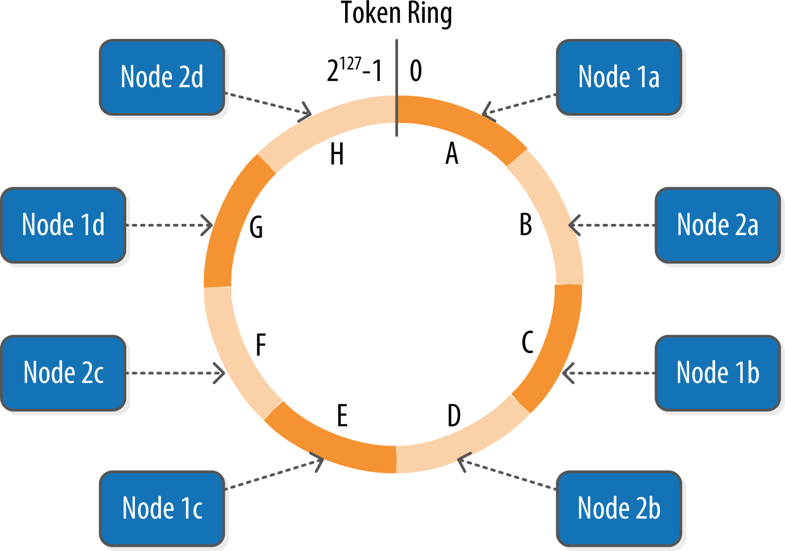

https://learning.oreilly.com/library/view/cassandra-the-definitive/9781491933657/ch06.html

### Data Centers and Racks
Cassandra is frequently used in systems spanning physically separate locations. Cassandra provides two levels of grouping that are used to describe the topology of a cluster: data center and rack. A rack is a logical set of nodes in close proximity to each other, perhaps on physical machines in a single rack of equipment. A data center is a logical set of racks, perhaps located in the same building and connected by reliable network.

---------------------------------------------------------------------------------------------------------------------

### Gossip and Failure Detection
To support decentralization and partition tolerance, Cassandra uses a gossip protocol that ***allows each node to keep track of state information about the other nodes in the cluster***. The gossiper runs every second on a timer.

Gossip protocols (sometimes called “epidemic protocols”) generally assume a faulty network, are commonly employed in very large, decentralized network systems, and are often used as an automatic mechanism for replication in distributed databases. They take their name from the concept of human gossip, a form of communication in which peers can choose with whom they want to exchange information.

----------------------------------------------------------------------------------------------------------------------

### Snitches
The job of a snitch is to determine relative host proximity for each node in a cluster, which is used to determine which nodes to read and write from. Snitches gather information about your network topology so that Cassandra can efficiently route requests. The snitch will figure out where nodes are in relation to other nodes.

As an example, let’s examine how the snitch participates in a read operation. When Cassandra performs a read, it must contact a number of replicas determined by the consistency level. In order to support the maximum speed for reads, Cassandra selects a single replica to query for the full object, and asks additional replicas for hash values in order to ensure the latest version of the requested data is returned. The role of the snitch is to help identify the replica that will return the fastest, and this is the replica which is queried for the full data.

Your selected snitch is wrapped with another snitch called the DynamicEndpointSnitch. The dynamic snitch gets its basic understanding of the topology from the selected snitch. ***It then monitors the performance of requests to the other nodes, even keeping track of things like which nodes are performing compaction. The performance data is used to select the best replica for each query. This enables Cassandra to avoid routing requests to replicas that are performing poorly.***

----------------------------------------------------------------------------------------------------------------------

### Rings and Tokens

So far we’ve been focusing on how Cassandra keeps track of the physical layout of nodes in a cluster. Let’s shift gears and look at how Cassandra distributes data across these nodes.

***Cassandra represents the data managed by a cluster as a ring. Each node in the ring is assigned one or more ranges of data described by a token, which determines its position in the ring.*** A token is a 64-bit integer ID used to identify each partition. This gives a possible range for tokens from –263 to 263–1.

***A node claims ownership of the range of values less than or equal to each token and greater than the token of the previous node***. The node with lowest token owns the range less than or equal to its token and the range greater than the highest token, which is also known as the “wrapping range.” In this way, the tokens specify a complete ring. Figure 6-2 shows a notional ring layout including the nodes in a single data center. This particular arrangement is structured such that consecutive token ranges are spread across nodes in different racks.

***Data is assigned to nodes by using a hash function to calculate a token for the partition key. This partition key token is compared to the token values for the various nodes to identify the range, and therefore the node, that owns the data.***

-----------------------------------------------------------------------------------------------------------------------

### Virtual Nodes
Early versions of Cassandra assigned a single token to each node, in a fairly static manner, requiring you to calculate tokens for each node. Although there are tools available to calculate tokens based on a given number of nodes, it was still a manual process to configure the initial_token property for each node in the cassandra.yaml file. This also made adding or replacing a node an expensive operation, as rebalancing the cluster required moving a lot of data.

Cassandra’s 1.2 release introduced the concept of virtual nodes, also called vnodes for short. Instead of assigning a single token to a node, the token range is broken up into multiple smaller ranges. Each physical node is then assigned multiple tokens. By default, each node will be assigned 256 of these tokens, meaning that it contains 256 virtual nodes. Virtual nodes have been enabled by default since 2.0.

**Vnodes make it easier to maintain a cluster containing heterogeneous machines. For nodes in your cluster that have more computing resources available to them, you can increase the number of vnodes by setting the num_tokens property in the cassandra.yaml file***.  Conversely, you might set num_tokens lower to decrease the number of vnodes for less capable machines.

Cassandra automatically handles the calculation of token ranges for each node in the cluster in proportion to their num_tokens value. Token assignments for vnodes are calculated by the org.apache.cassandra.dht.tokenallocator.ReplicationAwareTokenAllocator class.

***A further advantage of virtual nodes is that they speed up some of the more heavyweight Cassandra operations such as bootstrapping a new node, decommissioning a node, and repairing a node. This is because the load associated with operations on multiple smaller ranges is spread more evenly across the nodes in the cluster.***

------------------------------------------------------------------------------------------------------------------------

### Partitioners
***A partitioner determines how data is distributed across the nodes in the cluster***. As we learned in Chapter 5, Cassandra stores data in wide rows, or “partitions.” Each row has a partition key that is used to identify the partition. ***A partitioner, then, is a hash function for computing the token of a partition key***. 
***Each row of data is distributed within the ring according to the value of the partition key token.***

Cassandra provides several different partitioners in the org.apache.cassandra.dht package (DHT stands for “distributed hash table”). The Murmur3Partitioner was added in 1.2 and has been the default partitioner since then; it is an efficient Java implementation on the murmur algorithm developed by Austin Appleby. It generates 64-bit hashes. The previous default was the RandomPartitioner.

Because of Cassandra’s generally pluggable design, you can also create your own partitioner by implementing the org.apache.cassandra.dht.IPartitioner class and placing it on Cassandra’s classpath.

------------------------------------------------------------------------------------------------------------------------

### Replication Strategies

