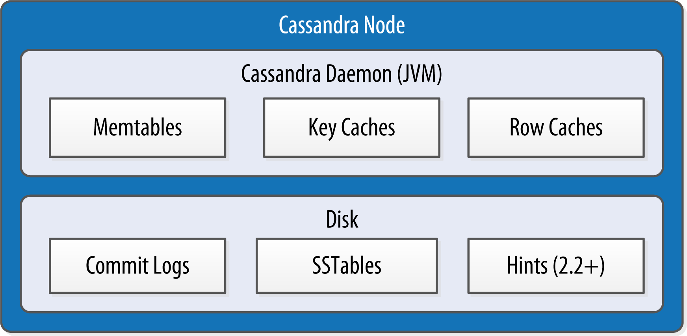

https://learning.oreilly.com/library/view/cassandra-the-definitive/9781491933657/ch06.html

### Data Centers and Racks
Cassandra is frequently used in systems spanning physically separate locations. Cassandra provides two levels of grouping that are used to describe the topology of a cluster: data center and rack. A rack is a logical set of nodes in close proximity to each other, perhaps on physical machines in a single rack of equipment. A data center is a logical set of racks, perhaps located in the same building and connected by reliable network.

---------------------------------------------------------------------------------------------------------------------

### Gossip and Failure Detection
To support decentralization and partition tolerance, Cassandra uses a gossip protocol that ***allows each node to keep track of state information about the other nodes in the cluster***. The gossiper runs every second on a timer.

Gossip protocols (sometimes called “epidemic protocols”) generally assume a faulty network, are commonly employed in very large, decentralized network systems, and are often used as an automatic mechanism for replication in distributed databases. They take their name from the concept of human gossip, a form of communication in which peers can choose with whom they want to exchange information.

----------------------------------------------------------------------------------------------------------------------

### Snitches
The job of a snitch is to determine relative host proximity for each node in a cluster, which is used to determine which nodes to read and write from. Snitches gather information about your network topology so that Cassandra can efficiently route requests. The snitch will figure out where nodes are in relation to other nodes.

As an example, let’s examine how the snitch participates in a read operation. When Cassandra performs a read, it must contact a number of replicas determined by the consistency level. In order to support the maximum speed for reads, Cassandra selects a single replica to query for the full object, and asks additional replicas for hash values in order to ensure the latest version of the requested data is returned. The role of the snitch is to help identify the replica that will return the fastest, and this is the replica which is queried for the full data.

Your selected snitch is wrapped with another snitch called the DynamicEndpointSnitch. The dynamic snitch gets its basic understanding of the topology from the selected snitch. ***It then monitors the performance of requests to the other nodes, even keeping track of things like which nodes are performing compaction. The performance data is used to select the best replica for each query. This enables Cassandra to avoid routing requests to replicas that are performing poorly.***

----------------------------------------------------------------------------------------------------------------------

### Rings and Tokens

So far we’ve been focusing on how Cassandra keeps track of the physical layout of nodes in a cluster. Let’s shift gears and look at how Cassandra distributes data across these nodes.

***Cassandra represents the data managed by a cluster as a ring. Each node in the ring is assigned one or more ranges of data described by a token, which determines its position in the ring.*** A token is a 64-bit integer ID used to identify each partition. This gives a possible range for tokens from –263 to 263–1.

***A node claims ownership of the range of values less than or equal to each token and greater than the token of the previous node***. The node with lowest token owns the range less than or equal to its token and the range greater than the highest token, which is also known as the “wrapping range.” In this way, the tokens specify a complete ring. Figure 6-2 shows a notional ring layout including the nodes in a single data center. This particular arrangement is structured such that consecutive token ranges are spread across nodes in different racks.

***Data is assigned to nodes by using a hash function to calculate a token for the partition key. This partition key token is compared to the token values for the various nodes to identify the range, and therefore the node, that owns the data.***

-----------------------------------------------------------------------------------------------------------------------

### Virtual Nodes
Early versions of Cassandra assigned a single token to each node, in a fairly static manner, requiring you to calculate tokens for each node. Although there are tools available to calculate tokens based on a given number of nodes, it was still a manual process to configure the initial_token property for each node in the cassandra.yaml file. This also made adding or replacing a node an expensive operation, as rebalancing the cluster required moving a lot of data.

Cassandra’s 1.2 release introduced the concept of virtual nodes, also called vnodes for short. Instead of assigning a single token to a node, the token range is broken up into multiple smaller ranges. Each physical node is then assigned multiple tokens. By default, each node will be assigned 256 of these tokens, meaning that it contains 256 virtual nodes. Virtual nodes have been enabled by default since 2.0.

**Vnodes make it easier to maintain a cluster containing heterogeneous machines. For nodes in your cluster that have more computing resources available to them, you can increase the number of vnodes by setting the num_tokens property in the cassandra.yaml file***.  Conversely, you might set num_tokens lower to decrease the number of vnodes for less capable machines.

Cassandra automatically handles the calculation of token ranges for each node in the cluster in proportion to their num_tokens value. Token assignments for vnodes are calculated by the org.apache.cassandra.dht.tokenallocator.ReplicationAwareTokenAllocator class.

***A further advantage of virtual nodes is that they speed up some of the more heavyweight Cassandra operations such as bootstrapping a new node, decommissioning a node, and repairing a node. This is because the load associated with operations on multiple smaller ranges is spread more evenly across the nodes in the cluster.***

------------------------------------------------------------------------------------------------------------------------

### Partitioners
***A partitioner determines how data is distributed across the nodes in the cluster***. As we learned in Chapter 5, Cassandra stores data in wide rows, or “partitions.” Each row has a partition key that is used to identify the partition. ***A partitioner, then, is a hash function for computing the token of a partition key***. 
***Each row of data is distributed within the ring according to the value of the partition key token.***

Cassandra provides several different partitioners in the org.apache.cassandra.dht package (DHT stands for “distributed hash table”). The Murmur3Partitioner was added in 1.2 and has been the default partitioner since then; it is an efficient Java implementation on the murmur algorithm developed by Austin Appleby. It generates 64-bit hashes. The previous default was the RandomPartitioner.

Because of Cassandra’s generally pluggable design, you can also create your own partitioner by implementing the org.apache.cassandra.dht.IPartitioner class and placing it on Cassandra’s classpath.

------------------------------------------------------------------------------------------------------------------------

### Replication Strategies
A node serves as a replica for different ranges of data. If one node goes down, other replicas can respond to queries for that range of data. Cassandra replicates data across nodes in a manner transparent to the user, and the replication factor is the number of nodes in your cluster that will receive copies (replicas) of the same data. If your replication factor is 3, then three nodes in the ring will have copies of each row.

The first replica will always be the node that claims the range in which the token falls, but the remainder of the replicas are placed according to the replication strategy (sometimes also referred to as the replica placement strategy). 

Out of the box, Cassandra provides two primary implementations of this interface (extensions of the abstract class): SimpleStrategy and NetworkTopologyStrategy. The SimpleStrategy places replicas at consecutive nodes around the ring, starting with the node indicated by the partitioner. The NetworkTopologyStrategy allows you to specify a different replication factor for each data center. Within a data center, it allocates replicas to different racks in order to maximize availability.

--------------------------------------------------------------------------------------------------------------------

### Consistency Levels

Consistency Levels
In Chapter 2, we discussed Brewer’s CAP theorem, in which consistency, availability, and partition tolerance are traded off against one another. ***Cassandra provides tuneable consistency levels that allow you to make these trade-offs at a fine-grained level***. You specify a consistency level on each read or write query that indicates how much consistency you require. ***A higher consistency level means that more nodes need to respond to a read or write query, giving you more assurance that the values present on each replica are the same.***

For read queries, the consistency level specifies how many replica nodes must respond to a read request before returning the data. For write operations, the consistency level specifies how many replica nodes must respond for the write to be reported as successful to the client. Because Cassandra is eventually consistent, updates to other replica nodes may continue in the background.

The available consistency levels include ONE, TWO, and THREE, each of which specify an absolute number of replica nodes that must respond to a request. ***The QUORUM consistency level requires  a response from a majority  of the replica nodes (sometimes expressed as “replication factor / 2 + 1”)***. The ALL consistency level requires a response from all of the replicas.

For both reads and writes, the consistency levels of ANY, ONE, TWO, and THREE are considered weak, whereas QUORUM and ALL are considered strong. ***Consistency is tuneable in Cassandra because clients can specify the desired consistency level on both reads and writes.*** 

***There is an equation that is popularly used to represent the way to achieve strong consistency in Cassandra: R + W > N = strong consistency***. 

In this equation, R, W, and N are the read replica count, the write replica count, and the replication factor, respectively; all client reads will see the most recent write in this scenario, and you will have strong consistency.

### DISTINGUISHING CONSISTENCY LEVELS AND REPLICATION FACTORS
If you’re new to Cassandra, the replication factor can sometimes be confused with the consistency level. The replication factor is set per keyspace. The consistency level is specified per query, by the client. ***The replication factor indicates how many nodes you want to use to store a value during each write operation. The consistency level specifies how many nodes the client has decided must respond in order to feel confident of a successful read or write operation***. The confusion arises because the consistency level is based on the replication factor, not on the number of nodes in the system.

------------------------------------------------------------------------------------------------------------------------

### Queries and Coordinator Nodes

Let’s bring these concepts together to discuss ***how Cassandra nodes interact to support reads and writes from client applications. below figure show the typical path of interactions with Cassandra.***

A client may connect to any node in the cluster to initiate a read or write query. This node is known as the coordinator node. The coordinator identifies which nodes are replicas for the data that is being written or read and forwards the queries to them.

***For a write, the coordinator node contacts all replicas, as determined by the consistency level and replication factor, and considers the write successful when a number of replicas commensurate with the consistency level acknowledge the write.***

***For a read, the coordinator contacts enough replicas to ensure the required consistency level is met, and returns the data to the client.***

These, of course, are the “happy path” descriptions of how Cassandra works. We’ll soon discuss some of Cassandra’s high availability mechanisms, including hinted handoff.

-----------------------------------------------------------------------------------------------------------------

### Memtables, SSTables, and Commit Logs

Now let’s take a look at some of Cassandra’s internal data structures and files. Cassandra stores data both in memory and on disk to provide both high performance and durability. In this section, we’ll focus on Cassandra’s use of constructs called memtables, SSTables, and commit logs to support the writing and reading of data from tables.

When you perform a write operation, it’s immediately written to a commit log. The commit log is a crash-recovery mechanism that supports Cassandra’s durability goals. A write will not count as successful until it’s written to the commit log, to ensure that if a write operation does not make it to the in-memory store (the memtable, discussed in a moment), it will still be possible to recover the data. ***If you shut down the database or it crashes unexpectedly, the commit log can ensure that data is not lost. That’s because the next time you start the node, the commit log gets replayed. In fact, that’s the only time the commit log is read; clients never read from it.***

***After it’s written to the commit log, the value is written to a memory-resident data structure called the memtable***. Each memtable contains data for a specific table. In early implementations of Cassandra, memtables were stored on the JVM heap, but improvements starting with the 2.1 release have moved the majority of memtable data to native memory. This makes Cassandra less susceptible to fluctuations in performance due to Java garbage collection.

***When the number of objects stored in the memtable reaches a threshold, the contents of the memtable are flushed to disk in a file called an SSTable***. A new memtable is then created. This flushing is a non-blocking operation; multiple memtables may exist for a single table, one current and the rest waiting to be flushed. They typically should not have to wait very long, as the node should flush them very quickly unless it is overloaded.

***Each commit log maintains an internal bit flag to indicate whether it needs flushing. When a write operation is first received, it is written to the commit log and its bit flag is set to 1. There is only one bit flag per table, because only one commit log is ever being written to across the entire server. All writes to all tables will go into the same commit log, so the bit flag indicates whether a particular commit log contains anything that hasn’t been flushed for a particular table.*** Once the memtable has been properly flushed to disk, the corresponding commit log’s bit flag is set to 0, indicating that the commit log no longer has to maintain that data for durability purposes. Like regular logfiles, commit logs have a configurable rollover threshold, and once this file size threshold is reached, the log will roll over, carrying with it any extant dirty bit flags.

The SSTable is a concept borrowed from Google’s Bigtable. Once a memtable is flushed to disk as an SSTable, it is immutable and cannot be changed by the application.  Despite the fact that SSTables are compacted, this compaction changes only their on-disk representation; it essentially performs the “merge” step of a mergesort into new files and removes the old files on success.

### WHY ARE THEY CALLED “SSTABLES”?
The idea that “SSTable” is a compaction of “Sorted String Table” is somewhat inaccurate for Cassandra, because the data is not stored as strings on disk.

Since the 1.0 release, Cassandra has supported the compression of SSTables in order to maximize use of the available storage. This compression is configurable per table. Each SSTable also has an associated Bloom filter, which is used as an additional performance enhancer (see “Bloom Filters”).

***All writes are sequential, which is the primary reason that writes perform so well in Cassandra. No reads or seeks of any kind are required for writing a value to Cassandra because all writes are append operations***. This makes one key limitation on performance the speed of your disk. Compaction is intended to amortize the reorganization of data, but it uses sequential I/O to do so. So the performance benefit is gained by splitting; the write operation is just an immediate append, and then compaction helps to organize for better future read performance. If Cassandra naively inserted values where they ultimately belonged, writing clients would pay for seeks up front.

On reads, Cassandra will read both SSTables and memtables to find data values, as the memtable may contain values that have not yet been flushed to disk. Memtables are implemented by the org.apache.cassandra.db.Memtable class.

---------------------------------------------------------------------------------------------------------------------

### Caching

 Cassandra provides three forms of caching:
 
1) The key cache stores a map of partition keys to row index entries, facilitating faster read access into SSTables stored on disk. The key cache is stored on the JVM heap.

2) The row cache caches entire rows and can greatly speed up read access for frequently accessed rows, at the cost of more memory usage. The row cache is stored in off-heap memory.

3) The counter cache was added in the 2.1 release to improve counter performance by reducing lock contention for the most frequently accessed counters.

By default, key and counter caching are enabled, while row caching is disabled, as it requires more memory. Cassandra saves its caches to disk periodically in order to warm them up more quickly on a node restart.

----------------------------------------------------------------------------------------------------------------------

### Hinted Handoff

Consider the following scenario: a write request is sent to Cassandra, but a replica node where the write properly belongs is not available due to network partition, hardware failure, or some other reason. In order to ensure general availability of the ring in such a situation, Cassandra implements a feature called hinted handoff. You might think of a hint as a little Post-it note  that contains the information from the write request. If the replica node where the write belongs has failed, the coordinator will create a hint, which is a small reminder that says, “I have the write information that is intended for node B. I’m going to hang onto this write, and I’ll notice when node B comes back online; when it does, I’ll send it the write request.” That is, once it detects via gossip that node B is back online, node A will “hand off” to node B the “hint” regarding the write. Cassandra holds a separate hint for each partition that is to be written.

This allows Cassandra to be always available for writes, and generally enables a cluster to sustain the same write load even when some of the nodes are down. It also reduces the time that a failed node will be inconsistent after it does come back online.

In general, hints do not count as writes for the purposes of consistency level. The exception is the consistency level ANY, which was added in 0.6. This consistency level means that a hinted handoff alone will count as sufficient toward the success of a write operation. That is, even if only a hint was able to be recorded, the write still counts as successful. Note that the write is considered durable, but the data may not be readable until the hint is delivered to the target replica.

There is a practical problem with hinted handoffs (and guaranteed delivery approaches, for that matter): if a node is offline for some time, the hints can build up considerably on other nodes. Then, when the other nodes notice that the failed node has come back online, they tend to flood that node with requests, just at the moment it is most vulnerable (when it is struggling to come back into play after a failure). To address this problem, Cassandra limits the storage of hints to a configurable time window. It is also possible to disable hinted handoff entirely.

As its name suggests, org.apache.cassandra.db.HintedHandOffManager is the class that manages hinted handoffs internally.

***Although hinted handoff helps increase Cassandra’s availability, it does not fully replace the need for manual repair to ensure consistency.***

------------------------------------------------------------------------------------------------------------------------

### Lightweight Transactions and Paxos
As we discussed in Chapter 2, Cassandra provides tuneable consistency, including the ability to achieve strong consistency by specifying sufficiently high consistency levels. However, strong consistency is not enough to prevent race conditions in cases where clients need to read, then write data.

Cassandra’s LWT implementation is based on Paxos. ***Paxos is a consensus algorithm that allows distributed peer nodes to agree on a proposal, without requiring a master to coordinate a transaction***. Paxos and other consensus algorithms emerged as alternatives to traditional two-phase commit based approaches to distributed transactions (reference the note on Two-Phase Commit in The Problem with Two-Phase Commit). 

***The basic Paxos algorithm consists of two stages: prepare/promise, and propose/accept***. To modify data, a coordinator node can propose a new value to the replica nodes, taking on the role of leader. Other nodes may act as leaders simultaneously for other modifications. Each replica node checks the proposal, and if the proposal is the latest it has seen, it promises to not accept proposals associated with any prior proposals. Each replica node also returns the last proposal it received that is still in progress. If the proposal is approved by a majority of replicas, the leader commits the proposal, but with the caveat that it must first commit any in-progress proposals that preceded its own proposal.

The Cassandra implementation extends the basic Paxos algorithm in order to support the desired read-before-write semantics (also known as “check-and-set”), and to allow the state to be reset between transactions. It does this by inserting two additional phases into the algorithm, so that it works as follows:

1) Prepare/Promise
2) Read/Results
3) Propose/Accept
4) Commit/Ack

Thus, ***a successful transaction requires four round-trips between the coordinator node and replicas. This is more expensive than a regular write, which is why you should think carefully about your use case before using LWTs.***

Cassandra’s lightweight transactions are limited to a single partition. Internally, Cassandra stores a Paxos state for each partition. This ensures that transactions on different partitions cannot interfere with each other.

---------------------------------------------------------------------------------------------------------------------

### Tombstones
In the relational world, you might be accustomed to the idea of a “soft delete.” Instead of actually executing a delete SQL statement, the application will issue an update statement that changes a value in a column called something like “deleted.” Programmers sometimes do this to support audit trails, for example.

There’s a similar concept in Cassandra called a tombstone. This is how all deletes work and is therefore automatically handled for you. When you execute a delete operation, the data is not immediately deleted. Instead, it’s treated as an update operation that places a tombstone on the value. A tombstone is a deletion marker that is required to suppress older data in SSTables until compaction can run.

---------------------------------------------------------------------------------------------------------------

### Bloom Filters
***Bloom filters are used to boost the performance of reads***. They are named for their inventor, Burton Bloom. ***Bloom filters are very fast, non-deterministic algorithms for testing whether an element is a member of a set. They are non-deterministic because it is possible to get a false-positive read from a Bloom filter, but not a false-negative***. Bloom filters work by mapping the values in a data set into a bit array and condensing a larger data set into a digest string using a hash function. The digest, by definition, uses a much smaller amount of memory than the original data would. The filters are stored in memory and are used to improve performance by reducing the need for disk access on key lookups. Disk access is typically much slower than memory access. ***So, in a way, a Bloom filter is a special kind of cache***. When a query is performed, the Bloom filter is checked first before accessing disk. Because false-negatives are not possible, if the filter indicates that the element does not exist in the set, it certainly doesn’t; but if the filter thinks that the element is in the set, the disk is accessed to make sure.

Bloom filters are implemented by the org.apache.cassandra.utils.BloomFilter class. ***Cassandra provides the ability to increase Bloom filter accuracy (reducing the number of false positives) by increasing the filter size, at the cost of more memory. This false positive chance is tuneable per table.***

### OTHER USES OF BLOOM FILTERS
Bloom filters are used in other distributed database and caching technologies, including Apache Hadoop, Google Bigtable, and Squid Proxy Cache.

-------------------------------------------------------------------------------------------------------------------

### Compaction
As we already discussed, ****SSTables are immutable, which helps Cassandra achieve such high write speeds***. However, ***periodic compaction of these SSTables is important in order to support fast read performance and clean out stale data values***. A compaction operation in Cassandra is performed in order to merge SSTables. ***During compaction, the data in SSTables is merged: the keys are merged, columns are combined, tombstones are discarded, and a new index is created.***

On compaction, the merged data is sorted, a new index is created over the sorted data, and the freshly merged, sorted, and indexed data is written to a single new SSTable (***each SSTable consists of multiple files including: Data, Index, and Filter***). This process is managed by the class org.apache.cassandra.db.compaction.CompactionManager.

***Another important function of compaction is to improve performance by reducing the number of required seeks. There are a bounded number of SSTables to inspect to find the column data for a given key***. If a key is frequently mutated, it’s very likely that the mutations will all end up in flushed SSTables. Compacting them prevents the database from having to perform a seek to pull the data from each SSTable in order to locate the current value of each column requested in a read request.

***When compaction is performed, there is a temporary spike in disk I/O and the size of data on disk while old SSTables are read and new SSTables are being written.***

Cassandra supports multiple algorithms for compaction via the strategy pattern. The compaction strategy is an option that is set for each table. The compaction strategy extends the AbstractCompactionStrategy class. The available strategies include:

1) SizeTieredCompactionStrategy (STCS) is the default compaction strategy and is recommended for write-intensive tables

2) LeveledCompactionStrategy (LCS) is recommended for read-intensive tables

3) DateTieredCompactionStrategy (DTCS), which is intended for time series or otherwise date-based data.

### WHAT ABOUT MAJOR COMPACTION?
Users with prior experience may recall that Cassandra exposes an administrative operation called major compaction (also known as full compaction) that consolidates multiple SSTables into a single SSTable. While this feature is still available, the utility of performing a major compaction has been greatly reduced over time. In fact, usage is actually discouraged in production environments, as it tends to limit Cassandra’s ability to remove stale data. We’ll learn more about this and other administrative operations on SSTables available via nodetool 

------------------------------------------------------------------------------------------------------------------

### Anti-Entropy, Repair, and Merkle Trees
Cassandra uses an anti-entropy protocol, which is a type of gossip protocol for repairing replicated data. Anti-entropy protocols work by comparing replicas of data and reconciling differences observed between the replicas. Anti-entropy is used in Amazon’s Dynamo, and Cassandra’s implementation is modeled on that (see Section 4.7 of the Dynamo paper).

***Replica synchronization is supported via two different modes known as read repair and anti-entropy repair.  Read repair refers to the synchronization of replicas as data is read***. Cassandra reads data from multiple replicas in order to achieve the requested consistency level, and detects if any replicas have out of date values. If an insufficient number of nodes have the latest value, a read repair is performed immediately to update the out of date replicas. Otherwise, the repairs can be performed in the background after the read returns. This design is observed by Cassandra as well as by straight key/value stores such as Project Voldemort and Riak.

***Anti-entropy repair (sometimes called manual repair) is a manually initiated operation performed on nodes as part of a regular maintenance process. This type of repair is executed by using a tool called nodetool***, as we’ll learn about in Chapter 11. Running nodetool repair causes Cassandra to execute a major compaction (see “Compaction”).  During a major compaction,  the server initiates a TreeRequest/TreeReponse conversation to exchange Merkle trees with neighboring nodes. The Merkle tree is a hash representing the data in that table. If the trees from the different nodes don’t match, they have to be reconciled (or “repaired”) to determine the latest data values they should all be set to. This tree comparison validation is the responsibility of the org.apache.cassandra.service.AbstractReadExecutor class.

-------------------------------------------------------------------------------------------------------------------

### Managers and Services

### Cassandra Daemon
You can also create an in-memory Cassandra instance programmatically by using the class org.apache.cassandra.service.EmbeddedCassandraService. Creating an embedded instance can be useful for unit testing programs using Cassandra.

### Storage Engine
Cassandra’s core data storage functionality is commonly referred to as the storage engine, which consists primarily of classes in the org.apache.cassandra.db package. The main entry point is the ColumnFamilyStore class, which manages all aspects of table storage, including commit logs, memtables, SSTables, and indexes.

---------------------------------------------------------------------------------------------------------------------

### System Keyspaces
In true “dogfooding” style, Cassandra makes use of its own storage to keep track of metadata about the cluster and local node. This is similar to the way in which Microsoft SQL Server maintains the meta-databases master and tempdb. The master is used to keep information about disk space, usage, system settings, and general server installation notes; the tempdb is used as a workspace to store intermediate results and perform general tasks. The Oracle database always has a tablespace called SYSTEM, used for similar purposes.  The Cassandra system keyspaces are used much like these.

