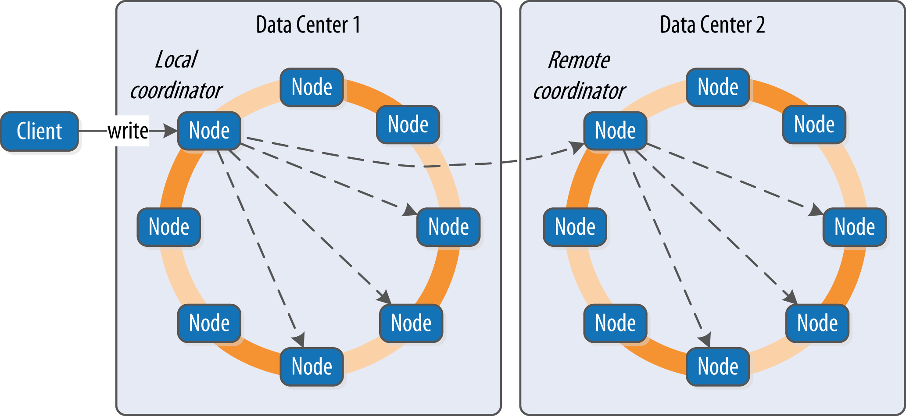

https://learning.oreilly.com/library/view/cassandra-the-definitive/9781491933657/ch09.html

Now that we understand the data model and how to use a simple client, we’ll dig deeper into the different kinds of queries you can perform in Cassandra to read and write data. ***We’ll also take a look behind the scenes to see how Cassandra handles your read and write queries.***

----------------------------------------------------------------------------------------------------------------

### Writing
Let’s start by noting some basic properties of writing data to Cassandra. First, ***writing data is very fast in Cassandra, because its design does not require performing disk reads or seeks***. The ***memtables and SSTables save Cassandra from having to perform these operations on writes, which slow down many databases. All writes in Cassandra are append-only.***

***Because of the database commit log and hinted handoff design, the database is always writable, and within a column family, writes are always atomic.***

----------------------------------------------------------------------------------------------------------------

### Write Consistency Levels
Cassandra’s tuneable consistency levels mean that you can specify in your queries how much consistency you require on writes. ***A higher consistency level means that more replica nodes need to respond, indicating that the write has completed. Higher consistency levels also come with a reduction in availability, as more nodes must be operational for the write to succeed.***

----------------------------------------------------------------------------------------------------------------

###  The Cassandra Write Path
The write path describes how data modification queries initiated by clients are processed, eventually resulting in the data being stored on disk. We’ll examine the write path both in terms of interactions between nodes, and the internal process of storing data on an individual node.

The write path begins when a client initiates a write query to a Cassandra node which serves as the coordinator for this request. The coordinator node uses the partitioner to identify which nodes in the cluster are replicas, according to the replication factor for the keyspace. The coordinator node may itself be a replica, especially if the client is using a token-aware driver. If the coordinator knows that there are not enough replicas up to satisfy the requested consistency level, it returns an error immediately.

Next, the coordinator node sends simultaneous write requests to all replicas for the data being written. This ensures that all nodes will get the write as long as they are up. Nodes that are down will not have consistent data, but they will be repaired via one of the anti-entropy mechanisms: hinted handoff, read repair, or anti-entropy repair.

If the cluster spans multiple data centers, the local coordinator node selects a remote coordinator in each of the other data centers to coordinate the write to the replicas in that data center. Each of the remote replicas responds directly to the original coordinator node.

The coordinator waits for the replicas to respond. Once a sufficient number of replicas have responded to satisfy the consistency level, the coordinator acknowledges the write to the client. If a replica doesn’t respond within the timeout, it is presumed to be down, and a hint is stored for the write. A hint does not count as successful replica write unless the consistency level ANY is used.

###  interactions that take place within each replica node to process a write request

First, the replica node receives the write request and immediately writes the data to the commit log. Next, the replica node writes the data to a memtable. If row caching is used and the row is in the cache, the row is invalidated.

If the write causes either the commit log or memtable to pass their maximum thresholds, a flush is scheduled to run.

At this point, the write is considered to have succeeded and the node can reply to the coordinator node or client.

After returning, the node executes a flush if one was scheduled. The contents of each memtable are stored as SSTables on disk and the commit log is cleared. After the flush completes, additional tasks are scheduled to check if compaction is needed and then a compaction is performed if necessary.

----------------------------------------------------------------------------------------------------------------

### Writing Files to Disk

### COMMIT LOG FILES
Cassandra writes commit logs to the filesystem as binary files. The commit log files are found under the $CASSANDRA_HOME/data/commitlog directory.

Commit log files are named according to the pattern CommitLog-<version>-<timestamp>.log. For example: CommitLog-6-1451831400468.log. The version is an integer representing the commit log format. For example, the version for the 3.0 release is 6. You can find the versions in use by release in the org.apache​.cassandra​.db.commitlog.CommitLogDescriptor class.
  
### SSTABLE FILES
***When SSTables are written to the filesystem during a flush, there are actually several files that are written per SSTable.*** Let’s take a look at the $CASSANDRA_HOME/data/data directory to see how the files are organized on disk.

Each SSTable is broken up into multiple files or components. These are the components as of the 3.0 release:

1) *-Data.db \
These are the files that store the actual data and are the only files that are preserved by Cassandra’s backup mechanisms, which we’ll learn about in Chapter 11.

2) *-CompressionInfo.db \
Provides metadata about the compression of the Data.db file.

3) *-Digest.adler32 \
Contains a checksum for the *-Data.db file. (Releases prior to 3.0 use CRC 32 checksums and the .crc32 extension.)

4) *-Filter.db \
Contains the bloom filter for this SSTable.

5) *-Index.db \
Provides row and column offsets within the corresponding *-Data.db file.

6) Summary.db \
A sample of the index for even faster reads.

7) Statistics.db \
Stores statistics about the SSTable which are used by the nodetool tablehistograms command.

8) TOC.txt \
Lists the file components for this SSTable.

-------------------------------------------------------------------------------------------------------------------------

### Reading
There are a few basic properties of Cassandra’s read capability that are worth noting. First, it’s easy to read data because clients can connect to any node in the cluster to perform reads, without having to know whether a particular node acts as a replica for that data. If a client connects to a node that doesn’t have the data it’s trying to read, the node it’s connected to will act as coordinator node to read the data from a node that does have it, identified by token ranges.

***In Cassandra, reads are generally slower than writes. To fulfill read operations, Cassandra typically has to perform seeks***, but you may be able to keep more data in memory by adding nodes, using compute instances with more memory, and using Cassandra’s caches. Cassandra also has to wait for responses synchronously on reads (based on consistency level and replication factor), and then perform read repairs as necessary.

### Read Consistency Levels
The consistency levels for read operations are similar to the write consistency levels, but their meanings are slightly different. A higher consistency level means that more nodes need to respond to the query, giving you more assurance that the values present on each replica are the same. If two nodes respond with different timestamps, the newest value wins, and that’s what will be returned to the client. In the background, Cassandra will then perform what’s called a read repair: it takes notice of the fact that one or more replicas responded to a query with an outdated value, and updates those replicas with the most current value so that they are all consistent.

### ALIGNING READ AND WRITE CONSISTENCY LEVELS

***The read and write consistency levels you choose to use in your applications are an example of the flexibility Cassandra provides us to make trade-offs between consistency, availability, and performance.***

***Cassandra can guarantee strong consistency on reads by using read and write consistency levels whose sum exceeds the replication factor***. ***One simple way to achieve this is to require QUORUM for reads and writes.***  For example, on a keyspace with a replication factor of 3, QUORUM represents a response from 2 out of three nodes. Because 2 + 2 > 3, strong consistency is guaranteed.

***If you are willing to sacrifice strong consistency in order to support increased throughput and more tolerance for downed nodes, you can use lesser consistency levels***. For example, using QUORUM for writes and ONE for reads doesn’t guarantee strong consistency, as 2 + 1 is merely equal to 3.

---------------------------------------------------------------------------------------------------------------------

### The Cassandra Read Path

Now let’s take a look at what happens when a client requests data. This is known as the read path. We’ll describe the read path from the perspective of a query for a single partition key, starting with the interactions between nodes 

The read path begins when a client initiates a read query to the coordinator node. As on the write path, the coordinator uses the partitioner to determine the replicas and checks that there are enough replicas up to satisfy the requested consistency level. Another similarity to the write path is that a remote coordinator is selected per data center for any read queries that involve multiple data centers.

***If the coordinator is not itself a replica, the coordinator then sends a read request to the fastest replica, as determined by the dynamic snitch. The coordinator node also sends a digest request to the other replicas. A digest request is similar to a standard read request, except the replicas return a digest, or hash, of the requested data.***

The coordinator calculates the digest hash for data returned from the fastest replica and compares it to the digests returned from the other replicas. If the digests are consistent, and the desired consistency level has been met, then the data from the fastest replica can be returned. If the digests are not consistent, then the coordinator must perform a read repair

1) When the replica node receives the read request, it first checks the row cache. If the row cache contains the data, it can be returned immediately. The row cache helps speed read performance for rows that are accessed frequently. 

2) If the data is not in the row cache, the replica node searches for the data in memtables and SSTables. There is only a single memtable for a given table, so that part of the search is straightforward. However, there are potentially many physical SSTables for a single Cassandra table, each of which may contain a portion of the requested data.

3) Cassandra implements several features to optimize the SSTable search: key caching, Bloom filters, SSTable indexes, and summary indexes.

4) The first step in searching SSTables on disk is to use a Bloom filter to determine whether requested partition does not exist in a given SSTable, which would make it unnecessary to search that SSTable.

### TUNING BLOOM FILTERS
Cassandra maintains a copy of Bloom filters in memory, although you may remember from our earlier discussion of files from above that the Bloom filters are stored in files alongside the SSTable data files so that they don’t have to be recalculated if the node is restarted.

The Bloom filter does not guarantee that the SSTable contains the partition, only that it might contain it. You can set the ***bloom_filter_fp_chance*** property on each table to control the percentage of false positives that the Bloom filter reports. This increased accuracy comes at the cost of additional memory use.

5) If the SSTable passes the Bloom filter, Cassandra checks the key cache to see if it contains the offset of the partition key in the SSTable. The key cache is implemented as a map structure in which the keys are a combination of the SSTable file descriptor and partition key, and the values are offset locations into SSTable files.  The key cache helps to eliminate seeks within SSTable files for frequently accessed data, because the data can be read directly.

6) ***If the offset is not obtained from the key cache, Cassandra uses a two-level index stored on disk in order to locate the offset. The first level index is the partition summary, which is used to obtain an offset for searching for the partition key within the second level index, the partition index. The partition index is where the offset into the SSTable for the partition key is stored.***

7) If the offset for the partition key is found, Cassandra accesses the SSTable at the specified offset and starts reading data.

